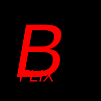

# React Boolflix

React Boolflix è un'applicazione web sviluppata con **React** e **Vite** che consente agli utenti di cercare film e serie TV, visualizzare i dettagli e scoprire i contenuti più popolari. L'app utilizza l'API di **The Movie Database (TMDb)** per recuperare i dati.

## Struttura del Progetto

Il progetto è organizzato in una struttura modulare per migliorare la manutenibilità e la leggibilità del codice. Di seguito è riportata la struttura principale:

```
.env
.gitignore
eslint.config.js
index.html
package.json
README.md
vite.config.js
public/
    vite.svg
src/
    App.jsx
    index.css
    main.jsx
    assets/
        react.svg
    components/
        Header.jsx
        Loader.jsx
        Main.jsx
        headerComponent/
            SearchBar.jsx
        mainComponents/
            Card.jsx
            CardFilms.jsx
            CardTvSeries.jsx
            Results.jsx
            TopCarousel.jsx
    config/
        apiOptions.jsx
    context/
        GlobalContext.jsx
        hooks/
            HighReatingShow.jsx
            TopNew.jsx
    layout/
        DefaultLayout.jsx
    pages/
        FilmsPage.jsx
        TvShowsPage.jsx
    utilities/
        ratingStar.jsx
```

### File Principali

- **`index.html`**: Punto di ingresso dell'applicazione.
- **`vite.config.js`**: Configurazione di Vite per il progetto.
- **`src/main.jsx`**: File principale che monta l'app React.
- **`src/App.jsx`**: Configurazione delle rotte e layout principali.
- **`src/context/GlobalContext.jsx`**: Contesto globale per la gestione dello stato condiviso.
- **`src/config/apiOptions.jsx`**: Configurazione delle opzioni per le richieste API.

### Componenti

#### Header

- **`Header.jsx`**: Contiene la barra di navigazione e il componente di ricerca.
- **`SearchBar.jsx`**: Barra di ricerca visibile solo nella homepage.

#### Main Components

- **`Main.jsx`**: Componente principale che gestisce la visualizzazione dei risultati e dei contenuti principali.
- **`Results.jsx`**: Mostra i risultati di film o serie TV in un layout a griglia.
- **`Card.jsx`**: Componente per visualizzare i dettagli di un singolo film o serie TV.
- **`TopCarousel.jsx`**: Mostra i film e le serie TV con alta valutazione.

#### Pages

- **`FilmsPage.jsx`**: Pagina dedicata ai film.
- **`TvShowsPage.jsx`**: Pagina dedicata alle serie TV.

#### Utilities

- **`ratingStar.jsx`**: Funzione per convertire una valutazione numerica in un sistema di stelle.

### Layout

- **`DefaultLayout.jsx`**: Layout principale che include l'header e il contenuto dinamico.

### Hooks

- **`TopNew.jsx`**: Hook personalizzato per recuperare i contenuti più popolari.
- **`HighReatingShow.jsx`**: Hook per gestire i contenuti con alta valutazione.

## Funzionalità

1. **Ricerca Film e Serie TV**: Gli utenti possono cercare film o serie TV utilizzando la barra di ricerca.
2. **Visualizzazione Dettagli**: Ogni film o serie TV è rappresentato da una card con dettagli come titolo, trama e valutazione.
3. **Contenuti Popolari**: Mostra i film e le serie TV più popolari.
4. **Valutazione con Stelle**: Le valutazioni sono rappresentate graficamente con stelle dorate o argentate.
5. **Navigazione**: Include una barra di navigazione per accedere rapidamente a diverse sezioni.

## Tecnologie Utilizzate

- **React**: Libreria per la creazione di interfacce utente.
- **Vite**: Tool di sviluppo per applicazioni moderne.
- **React Router**: Gestione delle rotte.
- **Bootstrap**: Framework CSS per il design responsivo.
- **TMDb API**: Fonte dei dati per film e serie TV.

## Come Avviare il Progetto

1. Clona il repository:

   ```sh
   git clone <repository-url>
   cd react-boolflix
   ```

2. Installa le dipendenze:

   ```sh
   npm install
   ```

3. Configura le variabili d'ambiente:
   Crea un file `.env` e aggiungi le seguenti variabili:

   ```
   VITE_API_URL=https://api.themoviedb.org/3/
   VITE_API_KEY=<la-tua-api-key>
   VITE_IMG_LINK=https://image.tmdb.org/t/p/
   ```

4. Avvia il server di sviluppo:

   ```sh
   npm run dev
   ```

5. Apri il browser e visita [http://localhost:5173](http://localhost:5173).

## Script Disponibili

- **`npm run dev`**: Avvia il server di sviluppo.
- **`npm run build`**: Compila il progetto per la produzione.
- **`npm run preview`**: Avvia un server per visualizzare il progetto compilato.
- **`npm run lint`**: Esegue ESLint per controllare il codice.

## Note

- Assicurati di avere una chiave API valida per TMDb.
- Il progetto utilizza **React 19** e **React Router 7**.

## Screenshot

### Homepage




---

Sviluppato con ❤️ da **Alessandro Sartini**.
